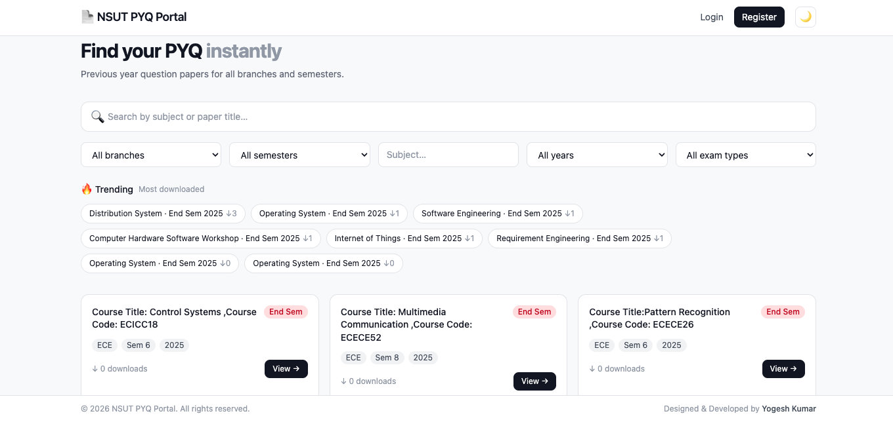
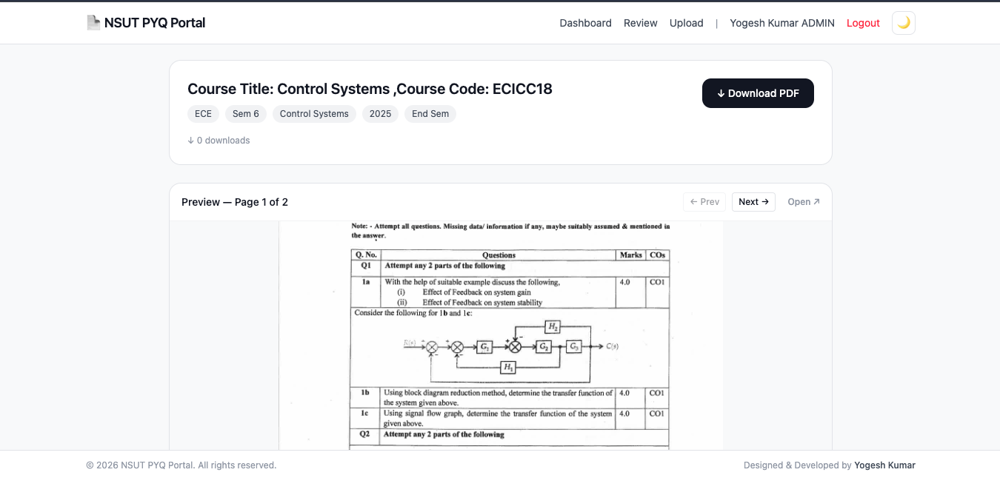
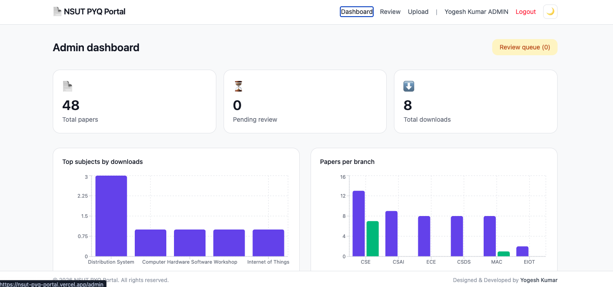

# 📄 NSUT PYQ Hub

A full-stack Previous Year Question Paper management portal for NSUT students — find, preview, and download papers instantly without visiting the library or digging through messy Google Drive folders.

**Live Demo:** [nsut-pyq-portal.vercel.app](https://nsut-pyq-portal.vercel.app)  
**Backend API:** [nsut-pyq-portal.onrender.com](https://nsut-pyq-portal.onrender.com)

---
## 📸 Screenshots

### Home Page


### PDF Preview


### Admin Dashboard


## Features

### For Students
-  **Smart Search** — instant search by subject or paper title with debounce
-  **Advanced Filters** — filter by branch (18 branches), semester (1–8), subject, year, and exam type
- **PDF Preview** — view papers in-browser before downloading using react-pdf
- **Download Tracking** — download count tracked per paper
- **Trending Papers** — see most downloaded papers at a glance
- **Student Uploads** — submit your own PYQs for admin review
- **Dark Mode** — persistent dark/light mode toggle
- **Responsive** — works on mobile and desktop

### For Admins
- **Analytics Dashboard** — bar charts for top subjects and branch-wise paper distribution
- **Subject Leaderboard** — ranked list of most downloaded subjects
- **Review Queue** — approve or reject student-submitted papers
- **Paper Management** — upload, edit metadata, and delete papers
- **Email Notifications** — automatic email sent to student on paper approval

### Auth & Security
- **JWT Authentication** — secure token-based auth with 7-day expiry
- **Email Verification** — verify account via email link before login
- **Google OAuth** — one-click sign in with Google
- **Role-Based Access** — student and admin roles with protected routes
- **Secret Admin Code** — register as admin using a secret code

---

## 🛠️ Tech Stack

### Frontend
| Technology | Purpose |
|------------|---------|
| React + Vite | UI framework |
| Tailwind CSS | Styling |
| React Router v6 | Client-side routing |
| Axios | API calls |
| react-pdf | In-browser PDF viewer |
| Recharts | Analytics charts |
| react-hot-toast | Notifications |

### Backend
| Technology | Purpose |
|------------|---------|
| Node.js + Express | REST API server |
| MongoDB + Mongoose | Database and ODM |
| JWT + bcryptjs | Authentication |
| Passport.js | Google OAuth strategy |
| Nodemailer | Email verification and notifications |
| Multer | File upload middleware |
| Cloudinary | PDF cloud storage |

### Deployment
| Service | Purpose |
|---------|---------|
| Vercel | Frontend hosting |
| Render | Backend hosting |
| MongoDB Atlas | Cloud database |
| Cloudinary | File storage |

---

## 📁 Project Structure

```
pyq-portal/
├── client/                      # React frontend
│   ├── public/
│   ├── src/
│   │   ├── api/
│   │   │   └── axios.js         # Axios instance + interceptors
│   │   ├── context/
│   │   │   └── AuthContext.jsx  # Global auth state
│   │   ├── components/
│   │   │   ├── Navbar.jsx
│   │   │   ├── Footer.jsx
│   │   │   ├── FilterBar.jsx
│   │   │   ├── PaperCard.jsx
│   │   │   └── ProtectedRoute.jsx
│   │   ├── pages/
│   │   │   ├── Home.jsx
│   │   │   ├── PaperView.jsx
│   │   │   ├── Login.jsx
│   │   │   ├── Register.jsx
│   │   │   ├── Upload.jsx
│   │   │   ├── AuthCallback.jsx
│   │   │   └── admin/
│   │   │       ├── Dashboard.jsx
│   │   │       └── ReviewQueue.jsx
│   │   ├── App.jsx
│   │   └── main.jsx
│   ├── vercel.json              # Vercel SPA rewrite rules
│   └── .env.development
│
└── server/                      # Node.js backend
    ├── config/
    │   ├── db.js                # MongoDB connection
    │   ├── cloudinary.js        # Cloudinary config
    │   └── passport.js          # Google OAuth strategy
    ├── controllers/
    │   ├── authController.js
    │   └── paperController.js
    ├── middleware/
    │   ├── authMiddleware.js    # JWT verify + adminOnly
    │   └── uploadMiddleware.js  # Multer config
    ├── models/
    │   ├── User.js
    │   └── Paper.js
    ├── routes/
    │   ├── authRoutes.js
    │   └── paperRoutes.js
    └── index.js
```

---

## ⚙️ Local Setup

### Prerequisites
- Node.js 18+
- MongoDB Atlas account
- Cloudinary account
- Google Cloud Console project (for OAuth)
- Gmail with App Password (for email)

### 1. Clone the repo

```bash
git clone https://github.com/y09e5hkumar/NSUT_PYQ-Portal.git
cd NSUT_PYQ-Portal
```

### 2. Backend setup

```bash
cd server
npm install
```

Create `server/.env`:

```env
PORT=5001
MONGO_URI=mongodb+srv://<user>:<pass>@cluster.mongodb.net/pyqportal
JWT_SECRET=your_jwt_secret
CLOUDINARY_CLOUD_NAME=your_cloud_name
CLOUDINARY_API_KEY=your_api_key
CLOUDINARY_API_SECRET=your_api_secret
EMAIL_USER=your_gmail@gmail.com
EMAIL_PASS=your_gmail_app_password
GOOGLE_CLIENT_ID=your_google_client_id
GOOGLE_CLIENT_SECRET=your_google_client_secret
SESSION_SECRET=any_random_string
ADMIN_SECRET_CODE=your_secret_admin_code
CLIENT_URL=http://localhost:5173
SERVER_URL=http://localhost:5001
NODE_ENV=development
```

```bash
npm run dev
```

### 3. Frontend setup

```bash
cd client
npm install
```

Create `client/.env.development`:

```env
VITE_API_URL=http://localhost:5001/api
VITE_SERVER_URL=http://localhost:5001
```

```bash
npm run dev
```

Frontend runs on `http://localhost:5173`, backend on `http://localhost:5001`.

### 4. Create your first admin

- Register normally on the site
- Use the secret admin code (from `.env`) in the "Register as admin?" field
- Admin has access to dashboard, review queue, and paper management

---

## 🔌 API Reference

### Auth
| Method | Endpoint | Description | Auth |
|--------|----------|-------------|------|
| POST | `/api/auth/register` | Register new user | Public |
| POST | `/api/auth/login` | Login user | Public |
| GET | `/api/auth/me` | Get current user | JWT |
| GET | `/api/auth/verify/:token` | Verify email | Public |
| POST | `/api/auth/resend-verification` | Resend verification email | Public |
| GET | `/api/auth/google` | Google OAuth login | Public |
| GET | `/api/auth/google/callback` | Google OAuth callback | Public |

### Papers
| Method | Endpoint | Description | Auth |
|--------|----------|-------------|------|
| GET | `/api/papers` | Get papers with filters | Public |
| GET | `/api/papers/trending` | Get top 10 by downloads | Public |
| GET | `/api/papers/:id` | Get single paper | Public |
| POST | `/api/papers` | Upload paper | JWT |
| PATCH | `/api/papers/:id/download` | Increment download count | Public |
| GET | `/api/papers/pending` | Get pending papers | Admin |
| PATCH | `/api/papers/:id/approve` | Approve paper | Admin |
| DELETE | `/api/papers/:id` | Delete paper | Admin |
| GET | `/api/papers/stats` | Get dashboard stats | Admin |
| GET | `/api/papers/branch-stats` | Get branch analytics | Admin |

---

## 🗄️ Database Schema

### User
```js
{
  name:               String,
  email:              String (unique),
  password:           String (bcrypt hashed),
  role:               'student' | 'admin',
  branch:             String,
  isVerified:         Boolean,
  googleId:           String,
  avatar:             String,
  verificationToken:  String,
  verificationExpiry: Date,
}
```

### Paper
```js
{
  title:        String,
  branch:       'CSAI'|'CSE'|'CSDS'|'IT'|'ITNS'|'MAC'|'EIOT'|'ECE'|'EE'|'ICE'|'ME'|'BT'|'CSDA'|'CIOT'|'ECAM'|'MEEV'|'CE'|'GI',
  semester:     Number (1-8),
  subject:      String,
  year:         Number,
  examType:     'Mid Sem' | 'End Sem' | 'Summer Sem',
  pdfUrl:       String,
  cloudinaryId: String,
  uploadedBy:   ObjectId (ref: User),
  status:       'pending' | 'approved',
  downloads:    Number,
}
```

---

## 🚢 Deployment

### Frontend (Vercel)
1. Push code to GitHub
2. Import repo on [vercel.com](https://vercel.com)
3. Set root directory to `client`
4. Add environment variables:
   ```
   VITE_API_URL=https://your-backend.onrender.com/api
   VITE_SERVER_URL=https://your-backend.onrender.com
   ```
5. Deploy

### Backend (Render)
1. Create new Web Service on [render.com](https://render.com)
2. Connect your GitHub repo
3. Set root directory to `server`
4. Start command: `npm start`
5. Add all environment variables from `.env`
6. Deploy

---

## 🤝 Contributing

Students can contribute PYQs directly through the portal:

1. Register and verify your email
2. Click **Upload** in the navbar
3. Fill in the paper metadata and upload PDF
4. Your submission goes into a pending review queue
5. Admin approves → paper goes live → you get an email notification

---

## 👨‍💻 Developer

**Yogesh Kumar**  
B.Tech CSE, NSUT Delhi  
[GitHub](https://github.com/y09e5hkumar) · [LinkedIn](https://www.linkedin.com/in/yogesh-kumar-94398028a/)


